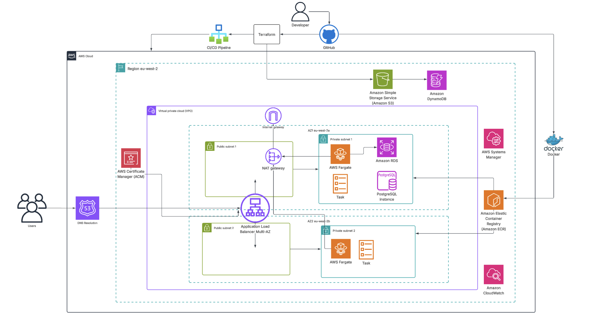
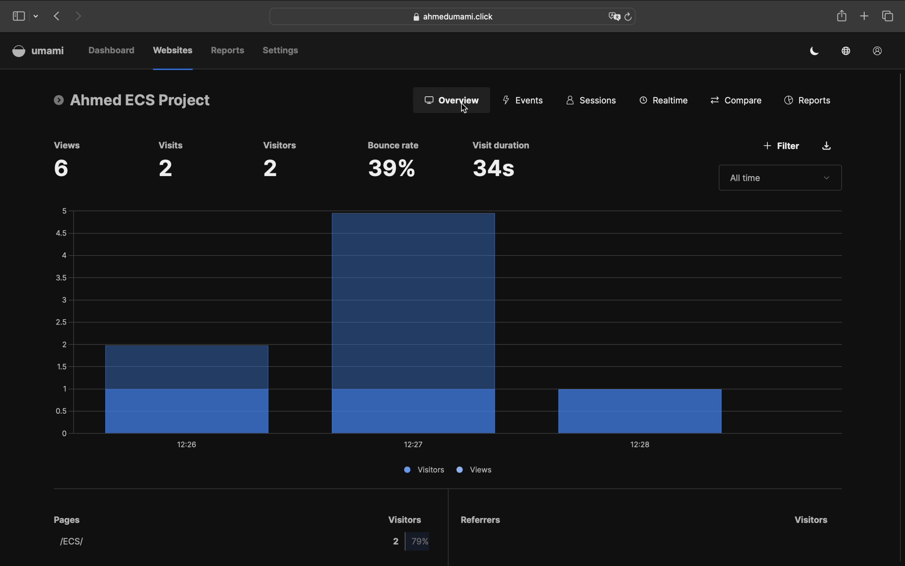
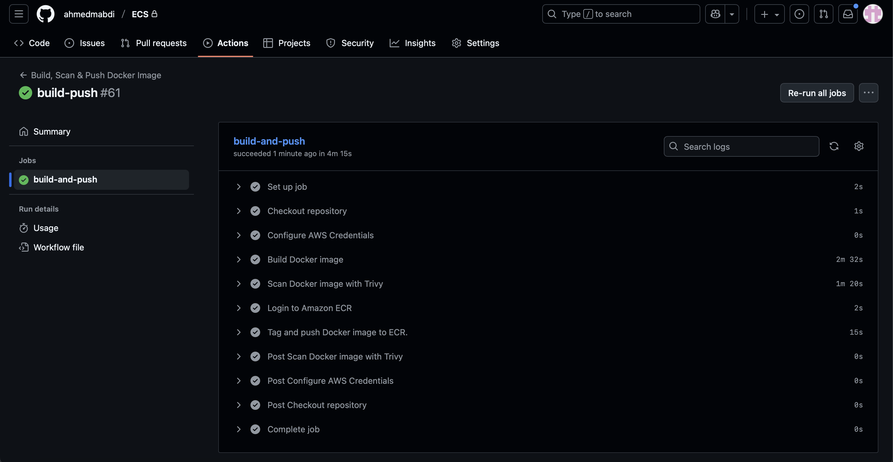
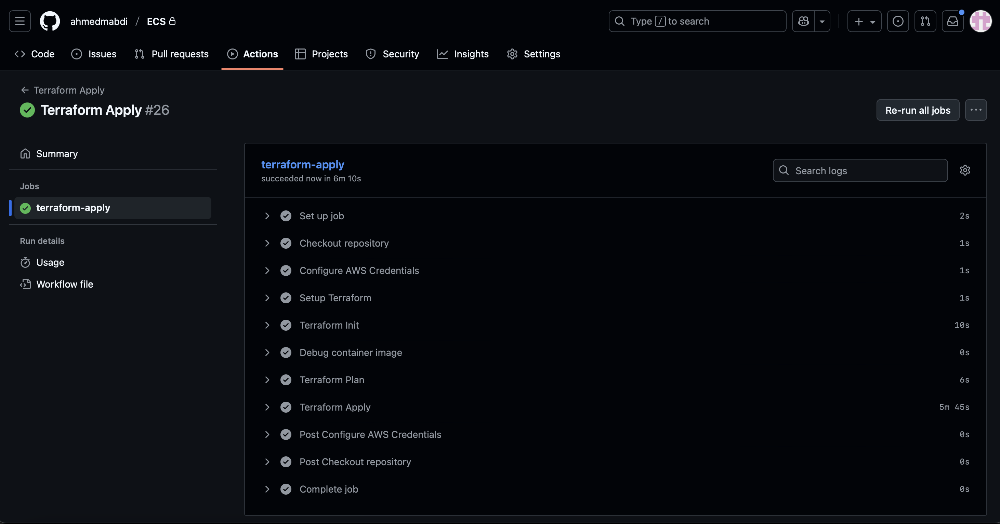
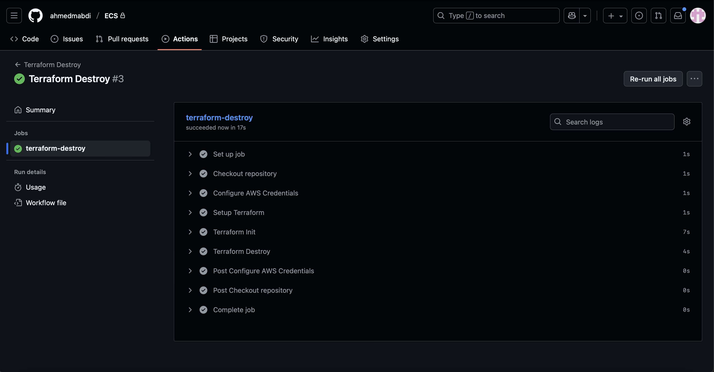

# ECS Project: Umami App

A fully containerised analytics application deployed on AWS using modern infrastructure-as-code, CI/CD pipelines, and container orchestration. This project demonstrates a cost-optimised setup for running **Umami**, an open-source web 
analytics platform, leveraging AWS ECS Fargate, Terraform, and Docker.

---
## Project Overview

This project demonstrates a full cloud deployment of **Umami** on AWS using **Terraform, Docker, and ECS Fargate**, with a cost-optimized setup for demos:

- **Infrastructure as Code**: Terraform provisions VPC and contents, IAM roles, RDS, ECS, ACM, SSM and Cloudwatch.
- **Database**: An **Amazon RDS (PostgreSQL)** instance is deployed to serve as the backend database for Umami, ensuring persistent, managed, and scalable storage.
- **Containerised Deployment**: Docker images stored in ECR, deployed on ECS Fargate with ALB and auto-scaling.
- **CI/CD**: Automated build, push, and deployment integrated into Terraform workflows.
- **Monitoring & Security**: CloudWatch for logs/metrics, SSM for secrets, ACM for SSL.
- **Networking & DNS**: Route 53 routing, single NAT Gateway, and single-AZ RDS for cost efficiency.
- **State Management**: S3 + DynamoDB for Terraform state locking.

> **Cost-Optimised**: Minimal resources suitable for demos while maintaining functionality.

---
## Architecture Diagram
  
The architecture consists of the following key components:

- **VPC** with public and private subnets across 2 AZ's
- **Single Application Load Balancer (ALB)** deployed across 2 AZ's for routing
- **ECS Fargate Cluster** running Umami containers with **auto-scaling**
- **Amazon RDS** (PostgreSQL) in single AZ
- **ECR** for Docker image storage
- **Route 53** for DNS management
- **ACM** for SSL certificates
- **CloudWatch** for logging and monitoring
- **IAM Roles & Policies** for secure access
- **SSM Parameter Store** for secrets
- **S3 + DynamoDB** for Terraform state

> **Cost Optimisation**: Single NAT Gateway, single-AZ RDS, minimal resource footprint suitable for demo environments.

## Future Improvements

To make this project production-ready, the following enhancements can be considered:

- **Security & Protection**
  - AWS WAF for protection against common web attacks
  - Enhanced security hardening with Security Hub and GuardDuty
  - Secrets Manager for more secure and scalable secret management

- **High Availability & Resilience**
  - Add NAT Gateway in AZ2 for fault tolerance
  - Enable Multi-AZ RDS for failover and resilience
  - Use Aurora over RDS for high performance, scalability and better durability

---
## Demo 

  
  

---

## CI/CD workflows
- **Build and Push**
  
- **Terraform Plan and Apply**
  
- **Terraform Destroy**

